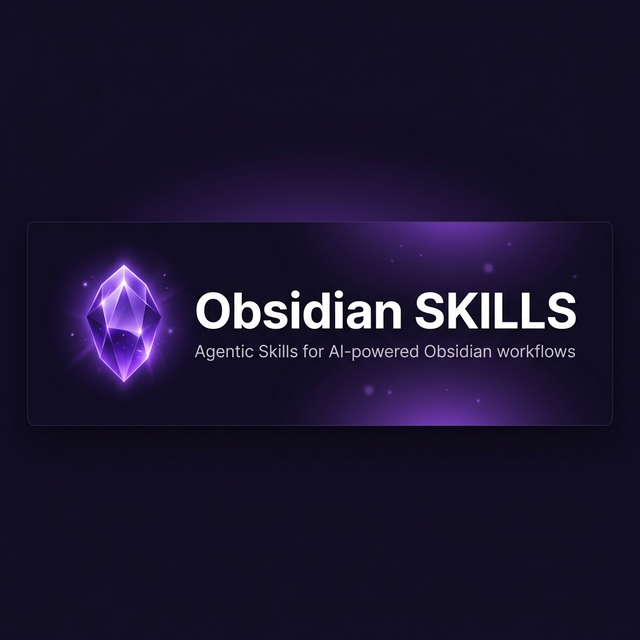

# 🪨✨ Obsidian Agentic Skills



> A collection of Agent Skills for Obsidian. Level-up your AI coding assistant with best practices for plugin development, theme customization, vault management, and more!

[](https://opensource.org/licenses/Apache-2.0)
[](https://claude.ai)
[](https://github.com/google-gemini/gemini-cli)
[](https://github.com/openai/codex)
[](https://cursor.sh)
[](https://github.com/google-deepmind)
[](https://github.com/anthropics/skills)
[](CONTRIBUTING.md)

---

## ✨ Included Skills

### 🧠 [`obsidian-best-practices`](skills/obsidian-best-practices/SKILL.md)

Equips AI agents with crucial patterns for developing within the Obsidian ecosystem:

- 🛡️ **Safety & Null Checking** — Defensive patterns for internal APIs and undocumented interfaces
- 🖊️ **Editor & CodeMirror 6** — Correct approaches for Live Preview mode interaction
- 📦 **Plugin Structure** — `manifest.json` requirements, installation naming rules, first-time loading gotchas
- 🎨 **UI Customization** — Native CSS variables, hover behavior, grid layouts, and icon alignment
- 🐛 **CLI Debugging Workflow** — Fast iteration loop using `obsidian-cli`

### 💻 [`obsidian-cli`](skills/obsidian-cli/SKILL.md)

Tweaks to the official [Obsidian CLI](https://help.obsidian.md/cli) that streamlines:

- 📝 **Vault Operations** — Read, create, append, and search notes via CLI
- ✅ **Task & Property Management** — Manage tasks, tags, properties, and daily notes
- 🔄 **Plugin Development Cycle** — Build → reload → error-check without leaving the terminal
- 🔍 **Live Inspection** — Evaluate JavaScript in app context, inspect DOM, capture screenshots

---

## 📋 Prerequisites

- **Obsidian** installed and open (the CLI requires a running instance)
- **Obsidian CLI** — installed globally (`obsidian help` should work in your terminal)
- An AI coding assistant that supports the Agent Skills standard (see platforms below)

---

## 🚀 Installation & Integration

This skill collection follows the [Agent Skills open standard](https://github.com/anthropics/skills) and works across all major AI coding platforms.

### Quick Reference Table

| **Platform**           | **Type** | **Installation Path**                                | **Invocation**                                    |
| ---------------------- | -------- | ---------------------------------------------------- | ------------------------------------------------- |
| **Google Antigravity** | IDE      | `.agent/skills/obsidian-best-practices/`             | Automatically invoked when relevant               |
| **Google Antigravity** | IDE      | `.agent/skills/obsidian-cli/`                        | Automatically invoked when relevant               |
| **Claude Code**        | CLI      | `~/.claude/skills/obsidian-best-practices/`          | `Use the Obsidian best practices skill...`        |
| **Gemini CLI**         | CLI      | `~/.gemini/skills/obsidian-best-practices/`          | Automatically invoked when relevant               |
| **OpenCode**           | IDE      | `~/.config/opencode/skills/obsidian-best-practices/` | `skill({ name: "obsidian-best-practices" })`      |
| **Cursor IDE**         | IDE      | `.cursor/skills/obsidian-best-practices/`            | Mentioned in chat with `@obsidian-best-practices` |
| **OpenAI Codex**       | CLI      | `~/.codex/skills/obsidian-best-practices/`           | Automatically invoked when relevant               |

### Installation

#### **Option 1: Clone from GitHub** (Recommended)

```bash
# For Google Antigravity (project skills — place in your vault's .agent folder)
git clone https://github.com/adriangrantdotorg/Obsidian-Skills.git .agent/skills

# For Claude Code (global skills)
git clone https://github.com/adriangrantdotorg/Obsidian-Skills.git ~/.claude/skills/obsidian

# For Gemini CLI (global skills)
git clone https://github.com/adriangrantdotorg/Obsidian-Skills.git ~/.gemini/skills/obsidian
```

#### **Option 2: Manual Installation**

1. Download the [latest release](https://github.com/adriangrantdotorg/Obsidian-Skills/releases)
2. Extract and copy the desired skill folder(s) to your platform's skills directory
3. Ensure each skill has a `SKILL.md` file at its root
4. If necessary, restart your AI assistant or reload the workspace

---

## 💡 Usage Examples

Once installed, your AI agent will automatically apply best practices when working with Obsidian. Here are some prompts to try:

### Plugin Development

```
"Build an Obsidian plugin that shows a floating word count for the active note"
```

The agent will:

- Structure `manifest.json` with correct `minAppVersion`
- Use optional chaining on all internal APIs
- Chain `npm run build && obsidian plugin:reload id=<plugin-id>` for fast iteration

### Debugging a Broken Plugin

```
"My plugin loads but doesn't seem to do anything — help me debug it"
```

The agent will:

- Run `obsidian dev:errors` to surface silent failures
- Use `obsidian eval code="..."` to inspect live app state
- Check `community-plugins.json` registration if the plugin is newly installed

### UI & CSS Fixes

```
"Fix the hover animation on my custom sidebar — elements jump around when I hover"
```

The agent will:

- Replace `display: none` ↔ `display: flex` transitions with `visibility: hidden/visible`
- Apply `position: absolute` for overlay elements to avoid reflowing siblings
- Use Obsidian's native CSS variables (`--text-normal`, `--nav-item-color-hover`, etc.)

### Vault Management via CLI

```
"Search my vault for all notes tagged #inbox and append a reminder to each one"
```

The agent will:

- Use `obsidian search query="#inbox"` to find matching notes
- Use `obsidian append file="..."` to update each note
- Respect vault targeting with `vault=<name>` if needed

---

## 🤝 Contributing

Contributions are welcome! Whether you're adding new skills, refining existing patterns, or improving documentation — your help makes this toolkit better for the whole Obsidian community 🙌🏾

**Quick Start for Contributors:**

```bash
# Fork and clone the repository
git clone https://github.com/adriangrantdotorg/Obsidian-Skills.git
cd Obsidian-Skills

# Create a feature branch
git checkout -b feature/your-skill-or-fix

# Make your changes and test them with your AI agent

# Commit and push
git commit -m "Add: description of your changes"
git push origin feature/your-skill-or-fix

# Open a Pull Request on GitHub
```

---

## 📚 Additional Resources

- **[Obsidian Developer Docs](https://docs.obsidian.md/Home)** — Official plugin & theme API reference
- **[Obsidian CLI Docs](https://help.obsidian.md/cli)** — Full CLI command reference
- **[Agent Skills Specification](https://github.com/anthropics/skills)** — Open standard documentation
- **[Obsidian Community Plugins](https://obsidian.md/plugins)** — Discover what others have built
- **[Obsidian Discord](https://discord.gg/obsidianmd)** — Community support and discussion

---

## 🐛 Issues & Support

Encountered a problem or have a suggestion?

- **Bug Reports**: [Open an issue](https://github.com/adriangrantdotorg/Obsidian-Skills/issues/new?template=bug_report.md)
- **Feature Requests**: [Request a feature](https://github.com/adriangrantdotorg/Obsidian-Skills/issues/new?template=feature_request.md)

---

<div align="center">
  <sub>Built with ❤️ for the Obsidian community & AI-powered workflows ✌🏾</sub>
</div>
